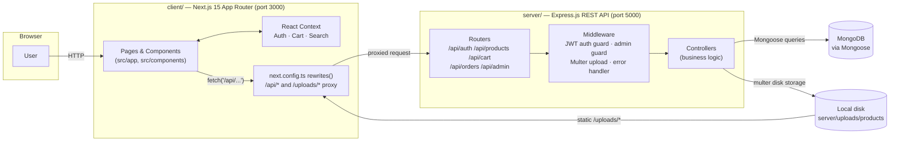

# ShopKart — Full-Stack E-Commerce Application

ShopKart is a full-stack e-commerce web application inspired by Flipkart. It lets shoppers browse a product catalogue, search with live suggestions, manage a cart, and place orders, while admins manage the entire product catalogue through a dedicated dashboard.

The project is a two-service monorepo:

- **`client/`** — a Next.js 15 (App Router) frontend written in TypeScript
- **`server/`** — an Express.js REST API backed by MongoDB (Mongoose)

---

## Table of Contents

- [Key Features](#key-features)
- [Architecture](#architecture)
- [Tech Stack](#tech-stack)
- [Repository Structure](#repository-structure)
- [Prerequisites](#prerequisites)
- [Getting Started](#getting-started)
- [Environment Variables](#environment-variables)
- [Database Setup & Seed Data](#database-setup--seed-data)
- [Running the App](#running-the-app)
- [Building for Production](#building-for-production)
- [Testing](#testing)
- [API Overview](#api-overview)
- [Known Limitations](#known-limitations)
- [Troubleshooting](#troubleshooting)
- [Deployment Notes](#deployment-notes)

---

## Key Features

- **Authentication** — register, log in, and log out with JWT-based sessions (`bcryptjs` password hashing)
- **Product Browsing** — category and sub-category grids, product detail pages with specs, ratings, and similar-product suggestions
- **Live Search** — debounced search suggestions with keyword highlighting, recent-search history, and a full search-results page with sorting and price filters
- **Cart** — works for guests (stored in `localStorage`) and merges into a database-backed cart on login
- **Checkout & Orders** — shipping address form, Cash on Delivery / Online Payment selection, and order history with status tracking
- **Admin Dashboard** (`/admin`) — live stats, and full create/edit/delete/list-toggle product management with drag-and-drop multi-image upload
- **Responsive UI** — Tailwind CSS across mobile, tablet, and desktop breakpoints

## Architecture



**Component responsibilities**

| Component | Responsibility |
|---|---|
| **Next.js App Router** (`client/src/app`) | File-based routing, server-rendered/static pages, page-level data fetching |
| **React Context** (`client/src/context`) | Client-side global state: `AuthContext` (JWT + user), `CartContext` (cart items, localStorage sync), `SearchContext` (query, debounced suggestions, recent searches) |
| **`next.config.ts` rewrites** | Proxies same-origin `/api/*` and `/uploads/*` requests from the browser to the Express server at `http://localhost:5000`, so the client never needs to know the backend's absolute URL in local development |
| **Express routers** (`server/routes`) | Map REST endpoints to controller functions; some are protected by `protect` (JWT) and `isAdmin` middleware |
| **Controllers** (`server/controllers`) | Request validation, business logic, and Mongoose queries |
| **Mongoose models** (`server/models`) | Schema definitions for `User`, `Product`, `Category`, `Cart`, `Order`, `Review` |
| **MongoDB** | Primary data store for all persisted entities |
| **Local disk uploads** (`server/uploads`) | Product images uploaded via the admin dashboard are stored on disk with Multer and served statically at `/uploads/*` (Cloudinary config exists but is not currently wired in — see [Known Limitations](#known-limitations)) |

The client and server are **independent processes** — there is no server-side rendering call into Express at build time; all communication happens over HTTP at request time, either directly from the browser (proxied) or from Next.js Server Components making `fetch()` calls during rendering.

## Tech Stack

| Layer | Technology |
|---|---|
| Frontend | Next.js 15 (App Router), React 19, TypeScript, Tailwind CSS 3 |
| Backend | Node.js, Express.js 4 (ES Modules) |
| Database | MongoDB, Mongoose 8 |
| Auth | JSON Web Tokens (`jsonwebtoken`), `bcryptjs` |
| File Uploads | Multer (local disk storage) |
| Icons | lucide-react |
| Dev Orchestration | `concurrently` (runs client + server with one command) |

No automated test framework is currently configured for either package (see [Testing](#testing)).

## Repository Structure

```
flipkart-clone/
├── client/                        # Next.js 15 frontend (TypeScript)
│   ├── src/
│   │   ├── app/                   # App Router pages & layouts
│   │   │   ├── admin/             # Admin dashboard + product CRUD pages
│   │   │   ├── cart/, checkout/, orders/, product/, category/, search/
│   │   │   ├── login/, register/
│   │   │   ├── layout.tsx         # Root layout + metadata
│   │   │   └── providers.tsx      # Auth + Cart + Search context providers
│   │   ├── components/
│   │   │   ├── layout/            # Navbar, Footer
│   │   │   ├── home/              # HeroBanner, CategoryBar, ProductGrid, DealsBanner
│   │   │   ├── product/           # ProductCard
│   │   │   ├── search/            # SearchDropdown
│   │   │   ├── admin/             # ProductForm
│   │   │   └── common/            # ToastContainer
│   │   ├── context/               # AuthContext, CartContext, SearchContext
│   │   ├── lib/data.ts            # Static category metadata used by the home page
│   │   └── types/global.d.ts
│   ├── public/                    # Static assets (favicon, etc.)
│   ├── next.config.ts             # Image remote patterns + /api & /uploads proxy rewrites
│   └── tailwind.config.ts         # Design tokens (colors, shadows, animations)
│
└── server/                        # Express.js backend (ES Modules)
    ├── models/                    # Mongoose schemas: User, Product, Category, Cart, Order, Review
    ├── controllers/                # Route handler logic
    ├── routes/                    # Express routers
    ├── middleware/                # auth (JWT + admin guard), upload (Multer), errorHandler
    ├── config/                    # db.js (Mongoose connection), cloudinary.js (configured, unused)
    ├── uploads/products/          # Locally stored product images (small demo set is committed)
    ├── seed.js                    # Database seed script (categories, products, users, orders, reviews)
    └── server.js                  # App entry point
```

## Prerequisites

- **Node.js 18.18+** (Node 20+ recommended — some devDependencies emit engine warnings on older Node 18/22.12 patch releases, though the app itself runs fine on Next.js's minimum of 18.18)
- **npm** (bundled with Node)
- **MongoDB** running locally on the default port `27017`, or a connection string to a remote MongoDB instance (e.g. MongoDB Atlas)
- **Git**

## Getting Started

```bash
# 1. Clone the repository
git clone https://github.com/krativerma23/Flipkart-Clone.git
cd Flipkart-Clone/flipkart-clone

# 2. Install dependencies for the root, client, and server in one step
npm run install:all

# 3. Create your local environment files from the examples (see below)
cp server/.env.example server/.env
cp client/.env.example client/.env   # optional — the client currently needs no env vars

# 4. Seed the database (creates demo users, categories, products, orders)
npm run seed

# 5. Start both the client and server together
npm run dev
```

- Frontend: **http://localhost:3000**
- Backend API: **http://localhost:5000**

> `cp` is a Unix/macOS/Git-Bash command. On plain Windows PowerShell, use `Copy-Item server\.env.example server\.env` instead.

### Demo Accounts (created by the seed script)

| Role | Email | Password |
|---|---|---|
| Admin | `admin@flipkart.com` | `Admin@1234` |
| User | `user1@flipkart.com` … `user8@flipkart.com` | `User@1234` |

The seed script creates one admin and eight demo customer accounts (`user1`–`user8`, each with a different sample name). These are local, non-production demo credentials created by `server/seed.js` — they only exist in your own local database after you run the seed script.

## Environment Variables

### `server/.env` (see `server/.env.example`)

| Variable | Required | Purpose |
|---|---|---|
| `PORT` | No (defaults to 5000) | Port the Express server listens on |
| `MONGO_URI` | **Yes** | MongoDB connection string. Use `127.0.0.1` rather than `localhost` to avoid IPv6/IPv4 resolution issues on machines where MongoDB only binds to IPv4 |
| `JWT_SECRET` | **Yes** | Secret used to sign JWTs — set this to a long, random string; never reuse the example placeholder in any deployed environment |
| `JWT_EXPIRES_IN` | No (defaults to `7d`) | Token expiry |
| `CLIENT_URL` | **Yes** | Origin allowed by the CORS middleware — must match the URL the frontend is served from |
| `CLOUDINARY_CLOUD_NAME` / `CLOUDINARY_API_KEY` / `CLOUDINARY_API_SECRET` | No | Present for future Cloudinary integration; not currently read by any upload path (see [Known Limitations](#known-limitations)) |
| `SMTP_HOST` / `SMTP_PORT` / `SMTP_USER` / `SMTP_PASS` / `SMTP_FROM` | No | Present for a `sendEmail` utility that is not currently called by any route |

### `client/.env` (see `client/.env.example`)

The client currently requires **no environment variables**. The API proxy target is hardcoded to `http://localhost:5000` inside `client/next.config.ts` via `rewrites()`. To point the client at a different backend host, edit that file directly.

**Never commit a real `.env` file.** Both `client/.env` and `server/.env` are covered by `.gitignore` — only the `.env.example` templates (with placeholder values) should be tracked.

## Database Setup & Seed Data

This project uses **MongoDB with Mongoose** and does not use a separate migration tool — Mongoose applies schema validation at the application layer, and collections/indexes are created automatically the first time documents are written.

1. Make sure MongoDB is running and reachable at the `MONGO_URI` in `server/.env`.
2. From the repository root, run:
   ```bash
   npm run seed
   ```
   (equivalent to `cd server && node seed.js`)
3. The script (`server/seed.js`) will:
   - **Clear** the `users`, `categories`, `products`, `carts`, `orders`, and `reviews` collections in the target database
   - Create demo users (including the admin account above)
   - Create parent + sub-categories (Electronics, Fashion, Mobiles, Beauty, etc.)
   - Create a full product catalogue with images, specs, and pricing
   - Create sample reviews, orders, wishlists, and carts

Re-run `npm run seed` any time to reset the database back to a known demo state. **Do not run this against a database containing real data** — it deletes existing documents in those collections first.

There are no production data dumps in this repository, and none should be committed.

## Running the App

```bash
npm run dev
```

This runs `client` (`next dev`) and `server` (`node --watch server.js`) concurrently via `concurrently`. Both processes auto-reload on file changes.

To run them independently:

```bash
npm run dev:client   # Next.js dev server on :3000
npm run dev:server   # Express server on :5000
```

## Building for Production

Only the client has a distinct build step (Next.js compiles and optimizes the app):

```bash
npm run build:client
# or: cd client && npm run build
cd client && npm start          # serves the production build on :3000
```

The Express server has no separate build step — it runs directly from source:

```bash
cd server && npm start          # node server.js (no file-watch/reload)
```

**Verified:** `npm run build:client` completes successfully (`✓ Compiled successfully`, 13 routes generated) as of this README's last update.

## Testing

**No automated test suite currently exists in this repository** — there are no test files, and neither `client/package.json` nor `server/package.json` declares a test framework (Jest, Vitest, Mocha, etc.). `npm test` is not defined in either package.

If you add tests, wire a `"test"` script into the relevant `package.json` and document the exact command here.

## API Overview

All endpoints are mounted under `/api` on the Express server (proxied through the Next.js client at the same path).

| Base path | Status | Notes |
|---|---|---|
| `/api/auth` | ✅ Implemented | `POST /register`, `POST /login`, `GET /me` (JWT-protected) |
| `/api/products` | ✅ Implemented | `GET /search`, `GET /suggestions`, `GET /category/:slug`, `GET /:id`, `GET /:id/similar` |
| `/api/cart` | ✅ Implemented | JWT-protected: `GET /`, `POST /add`, `PUT /update`, `DELETE /remove/:productId` |
| `/api/orders` | ✅ Implemented | JWT-protected: `POST /place`, `GET /my-orders`, `GET /:id` |
| `/api/admin` | ✅ Implemented | Admin-only (JWT + role guard): dashboard stats, product CRUD, listing toggle |
| `/api/categories` | ⚠️ Stubbed | Router and controller exist but have no handlers wired — category browsing is served via `/api/products/category/:slug` instead |
| `/api/reviews` | ⚠️ Stubbed | `Review` model exists; the API is not implemented |
| `/api/users` | ⚠️ Stubbed | No handlers beyond what `/api/auth` already provides |

## Known Limitations

These are accurate as of this cleanup pass — documented so the README doesn't overstate functionality:

- **`/api/categories`, `/api/reviews`, `/api/users`** are mounted in `server.js` but their routers are empty stubs (`// TODO: wire up controllers`). They currently return a generic 404 for any sub-path.
- **Cloudinary is configured but not used.** `server/config/cloudinary.js` reads `CLOUDINARY_*` env vars, but the upload middleware (`server/middleware/upload.js`) stores files on local disk via Multer, not Cloudinary. Uploaded images live under `server/uploads/products/` and are served via the `/uploads` static route.
- **Email sending is configured but not used.** `server/utils/sendEmail.js` exists but is not called from any controller.
- **The client's API proxy target is hardcoded** (`http://localhost:5000` in `client/next.config.ts`) rather than driven by an environment variable, so deploying the client and server to different hosts requires editing that file rather than setting a variable.

## Troubleshooting

- **`Unexpected token 'I', "Internal S"... is not valid JSON` in the browser** — the Express server isn't running or crashed on startup (often a MongoDB connection failure). Check the server terminal output.
- **`MongooseServerSelectionError: connect ECONNREFUSED ::1:27017`** — on some machines `localhost` resolves to the IPv6 loopback (`::1`) first, but MongoDB only listens on IPv4 (`127.0.0.1`). Fix: set `MONGO_URI=mongodb://127.0.0.1:27017/flipkart-clone` in `server/.env` (already the default in `server/.env.example`).
- **`EADDRINUSE: address already in use :::5000` or `:::3000`** — another process (possibly a previous `npm run dev` you forgot to stop) is already using the port. Stop it or change `PORT` in `server/.env`.
- **Category pages show 0 products / broken images** — confirm you've run `npm run seed` and that MongoDB is reachable.
- **Admin dashboard is empty or redirects to `/login`** — log in with the seeded admin account; only users with `role: 'admin'` can access `/admin`.

## Deployment Notes

This repository is configured for local development. If you deploy it:

- **Frontend** — any Next.js-compatible host (e.g. Vercel). Update the `destination` values in `client/next.config.ts`'s `rewrites()` to point at your deployed backend URL instead of `http://localhost:5000`.
- **Backend** — any Node.js host (e.g. Render, Railway, a VPS). Set `MONGO_URI` to a managed MongoDB instance (e.g. MongoDB Atlas), set a strong random `JWT_SECRET`, and set `CLIENT_URL` to your deployed frontend's origin for CORS.
- **File uploads** — the current local-disk upload strategy will not persist across most container-based/serverless deployments (ephemeral filesystems). Wire up the existing `server/config/cloudinary.js` (or another object store) before deploying if the admin image-upload feature needs to work in production.
- **Database** — never point a deployment at a database seeded with `npm run seed`'s demo data; seed a fresh production database with real content instead, or clear demo accounts before going live.
